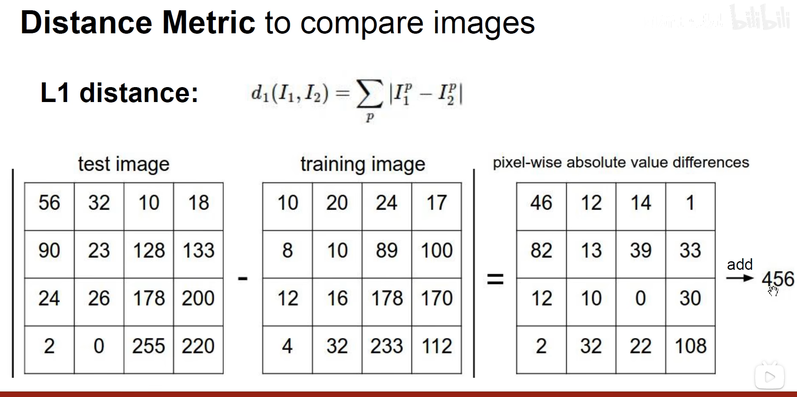
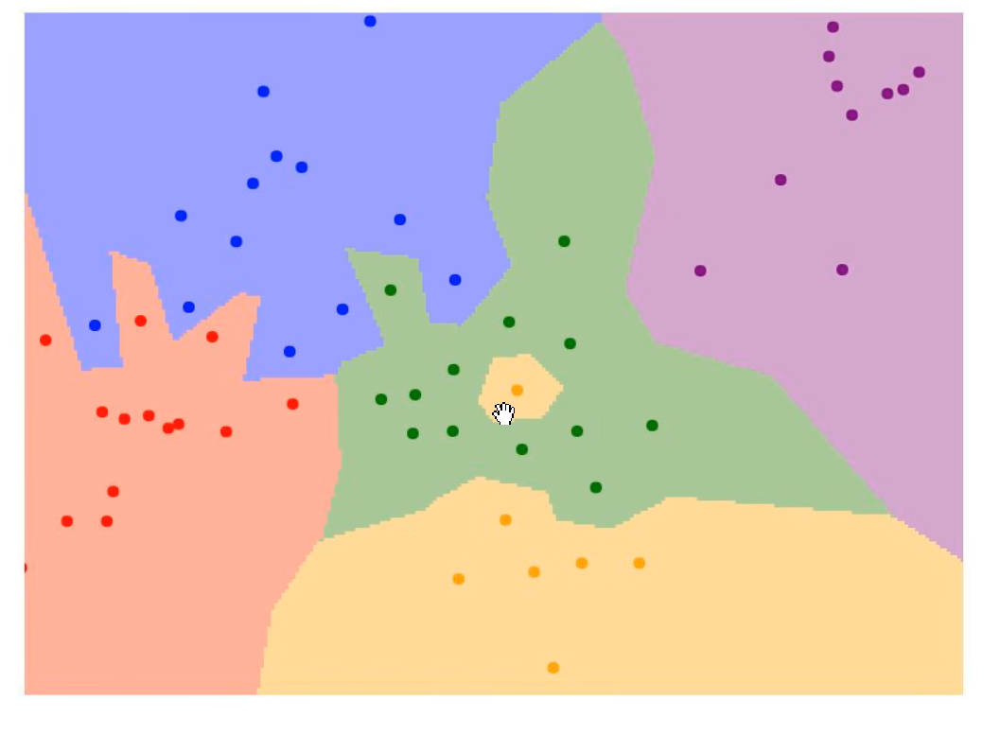
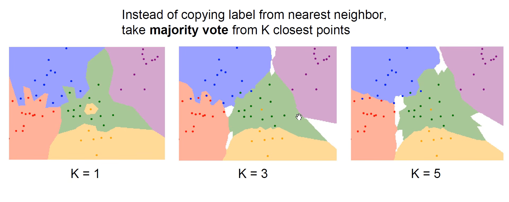
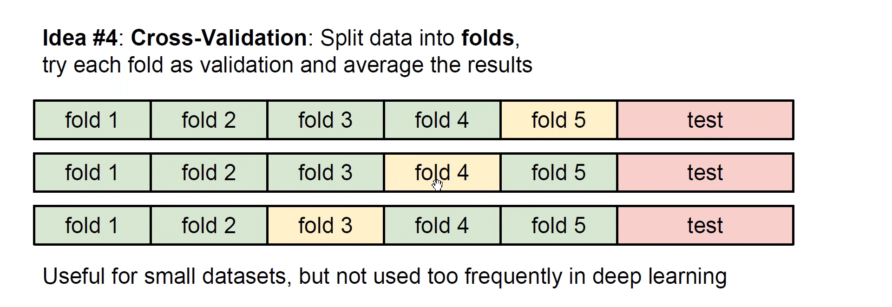
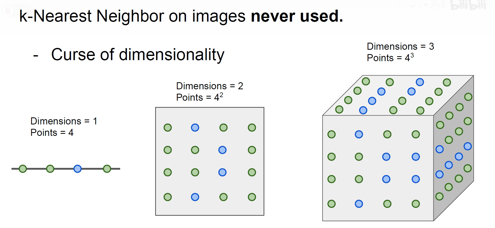
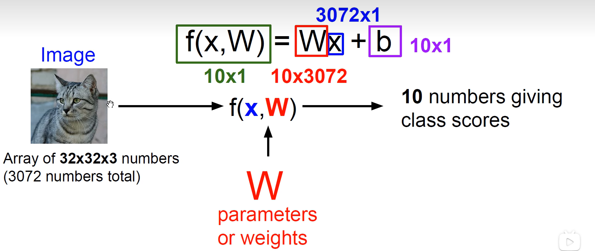
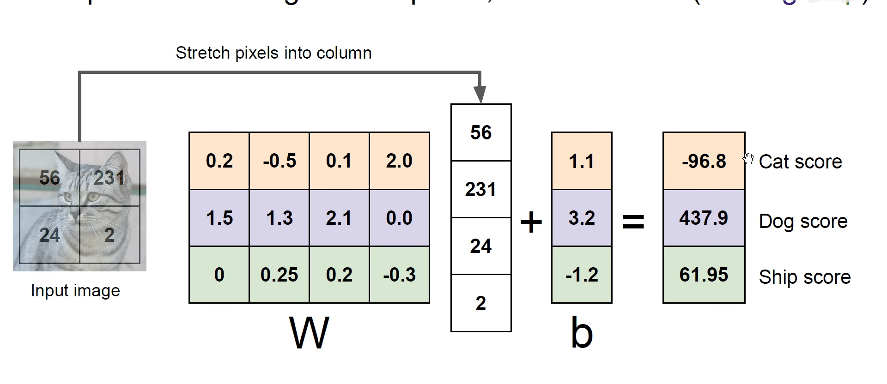
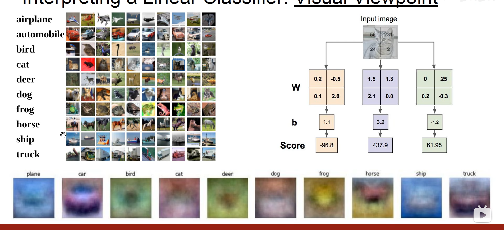

# kNN与线性分类
代码无法显示的写出->数据驱动

获得训练集（含标签）

机器学习分类    

验证（避免过拟合）

## 最近邻算法

为惰性算法

使用CIFAR10数据集，每张图片都是32*32

对于测试集中的图片，从训练集中找到与之最相近的几张图片

计算方法:
获得L1距离（曼哈顿距离）对应坐标作差并将绝对值相加

训练O(1), 预测O(N);

--->我们想要一个可以训练慢，但可以快速预测的

使用最近邻算法，噪点过多，使用K-最近邻，边界更平滑

曼哈顿距离对坐标的旋转敏感，而欧几里得距离不敏感，曼哈顿距离适合与坐标轴更加明确的，欧几里得距离适合坐标系不敏感的。

->可视化链接
<vision.stanford.edu/teaching/cs231n-demos/knn/>

两个参数：K与距离评估指标

把数据集化为训练集、验证集、测试集

使用交叉验证：

可以尽可能得到准确的验证结果，5折，10折...

一些缺点
- 故意控制让图片L2距离相同
- 维度爆炸

优化算法->让不同邻居的权重不同

## 线性分类器

在二维空间内就是一条直线，一维空间就是一个点，三维空间就是一个平面

每一行都有一个类别的分类器的权重和截距,如果没有截距那么所有直线都恒过(0,0)点

将权重还原为32\*32*3的图像，就得到了最下方的样子

