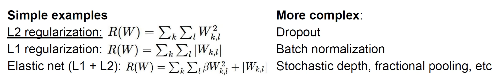

# 线性分类、损失函数与梯度下降

<vision.stanford.edu/teaching/cs231n-demos/linear-classify/>

### 损失函数

铰链损失函数

错误值与正确值的差加1与0的最大值再求和

最小值为0，最大值为正无穷

正则化

正则化避免过拟合
让权重更加简单，在测试集上更好的泛化

### softmax分类器 多分类的逻辑回归

将识别的分数转化为概率，先将分数使用指数函数  $e^x$ 特殊处理，可以将负数转化为正数,然后进行归一化

### 交叉熵损失函数

最小值为0，最大值为正无穷

数值解：慢
解析解：快

### 梯度

数值解：速度慢

解析解：使用求导公式，速度快

梯度下降的下降是使得损失函数下降，而不是梯度本身下降
