# 神经网络与反向传播
<cs.stanford.edu/people/karpathy/convnetjs/demo/classify2d.html>
端到端 数据驱动 学习得到要提取的特征

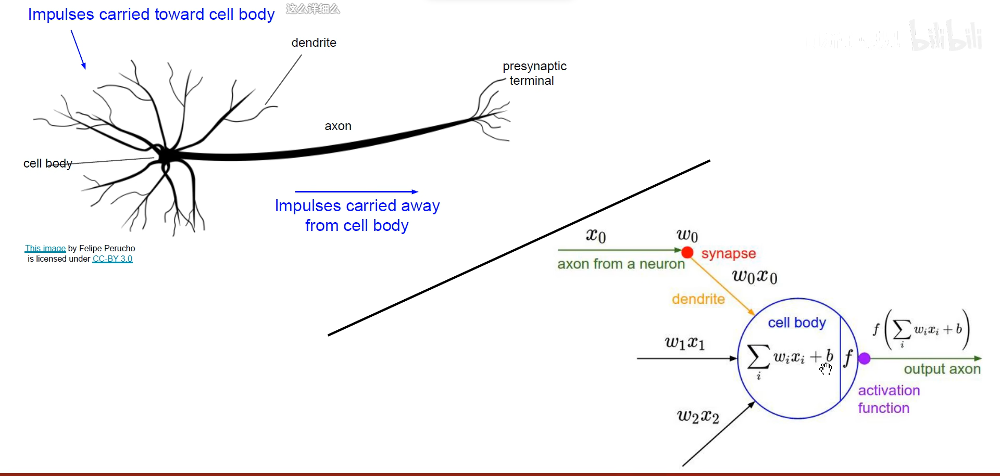

函数评估权重，是否输出

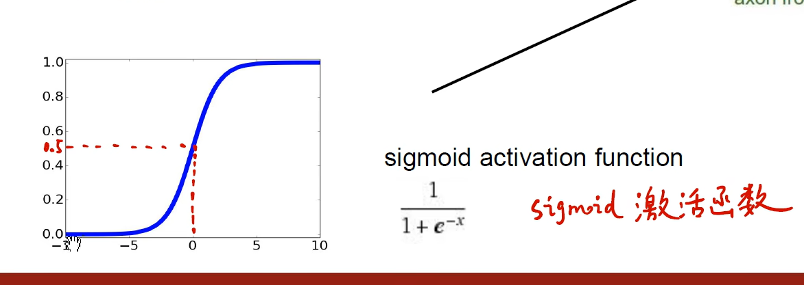

各种激活函数：

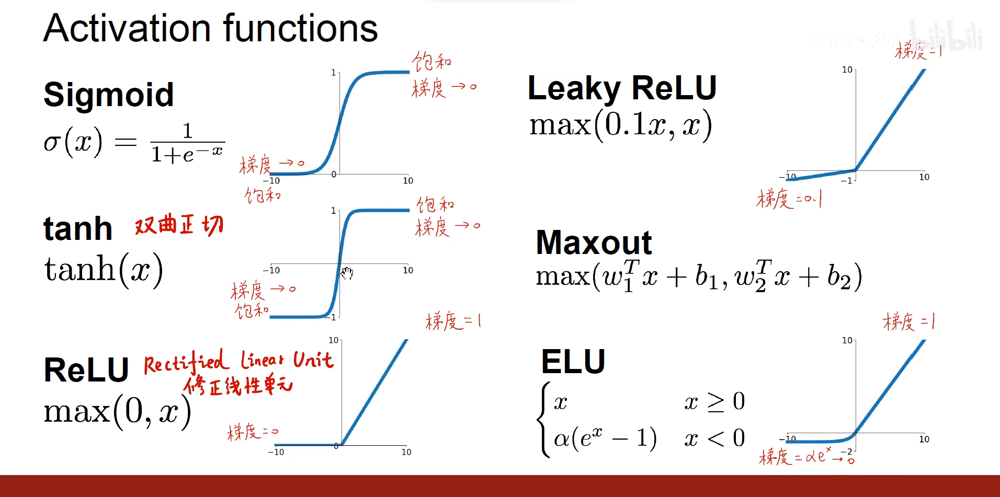

第一个可用于二分类问题，含有一个隐含层
第二个如果使用的是sigmoid，也可用于二分类

全连接神经网络
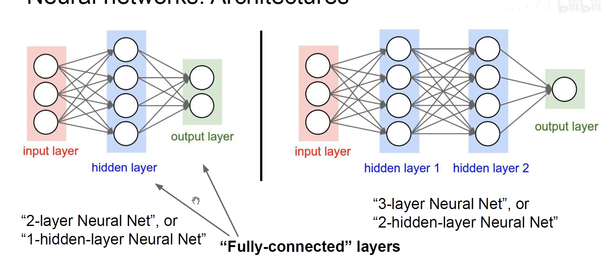

反向传播理解

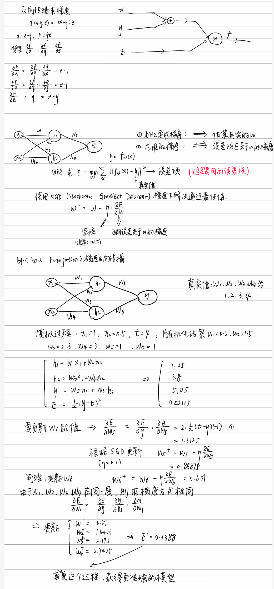

sigmoid函数的导数

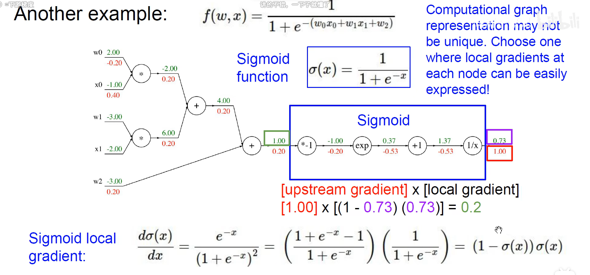

不同运算对应的反向传播

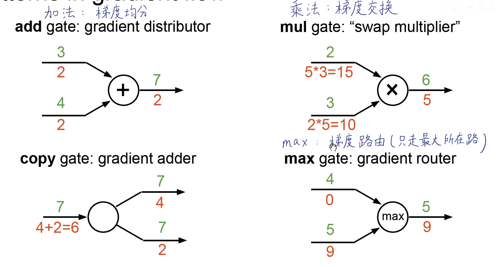

正向计算与反向传播

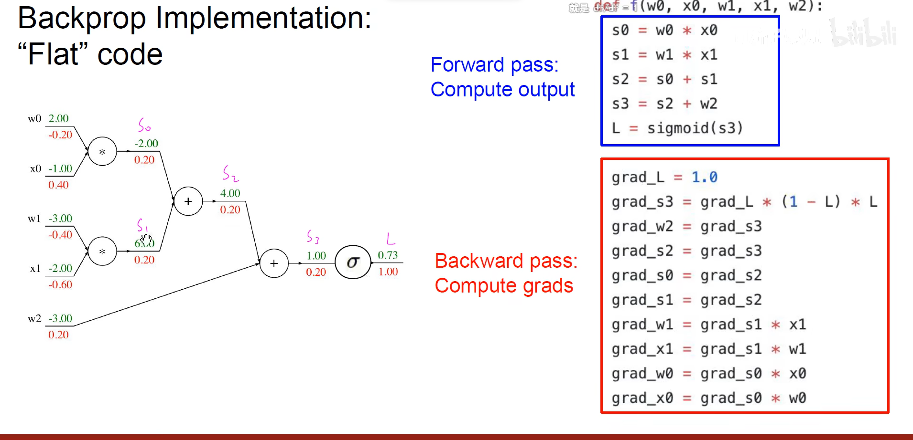

不同类型的输入及输出

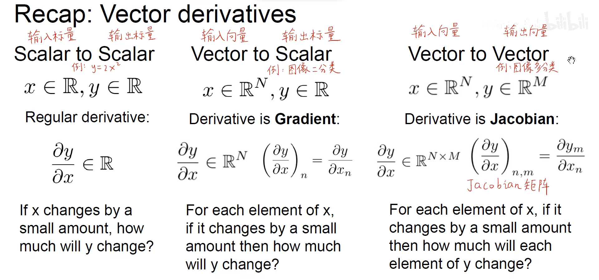

矩阵的反向

范数（norm）

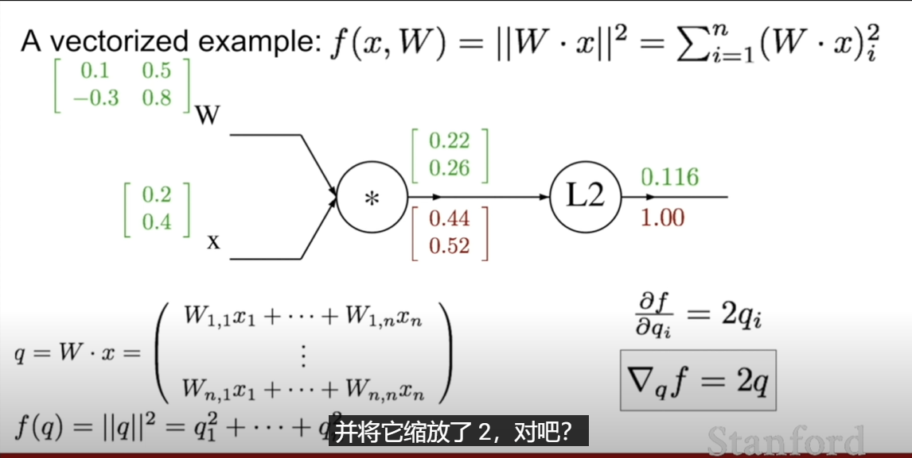

多维矩阵的求导

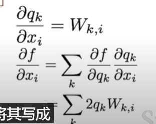

最终结果,必须和原矩阵有相同的维度

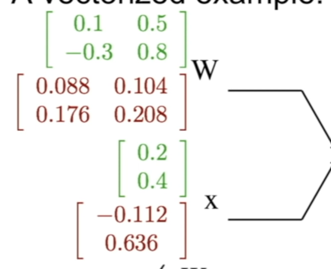