### 卷积神经网络

<https://poloclub.github.io/cnn-explainer/>
<https://tensorspace.org/html/playground/lenet.html>

卷积，池化（降采样），全连接

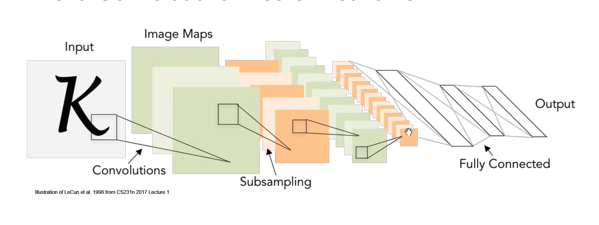

相比于将32\*32*3的转化为1\*3072的矩阵，会丢失像素之间空间上的信息

卷积核中的权重是不变的，权值共享，对应位置相乘
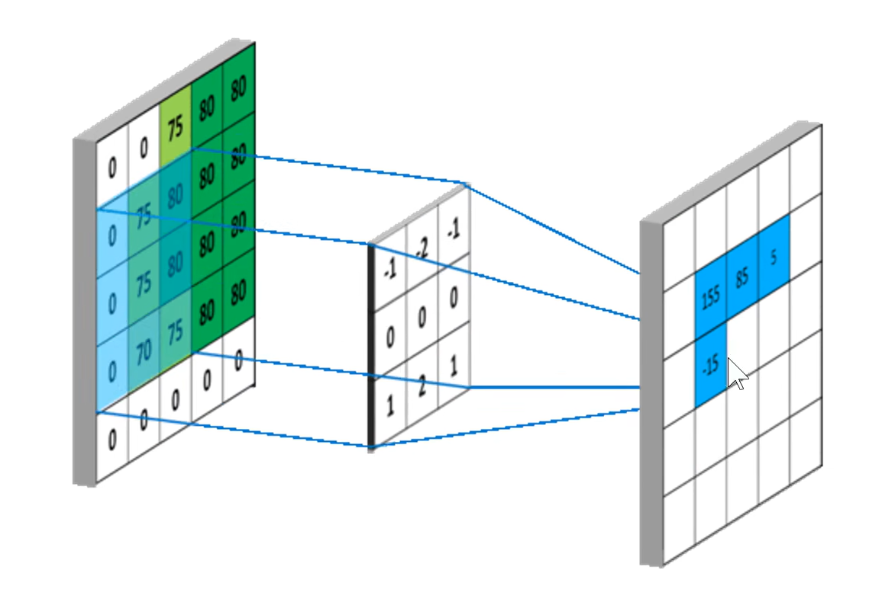

有多少卷积核就有多少feature map，feature map作为下次卷积运算

但是注意到四周的像素参与的运算过少，可以在四周补上0，称为padding操作，同时可以使feature map维度不变
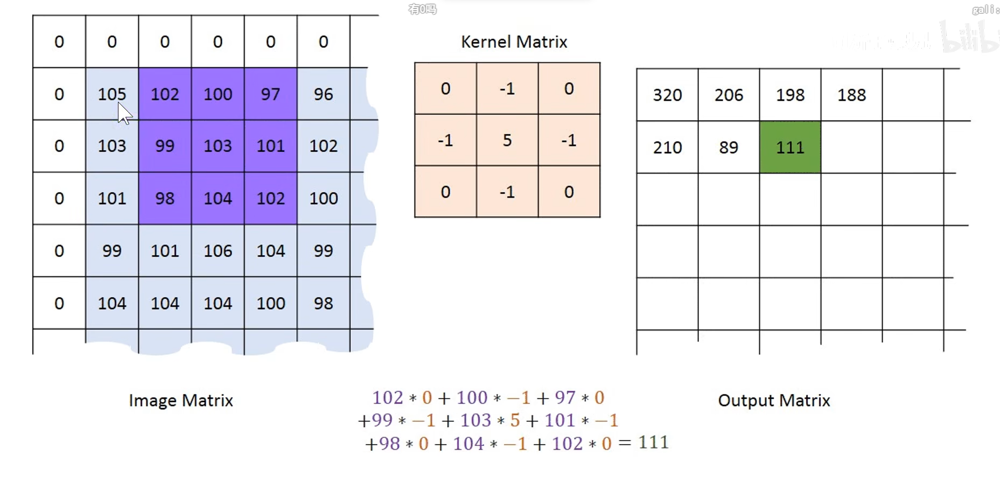

三通道图像的卷积操作
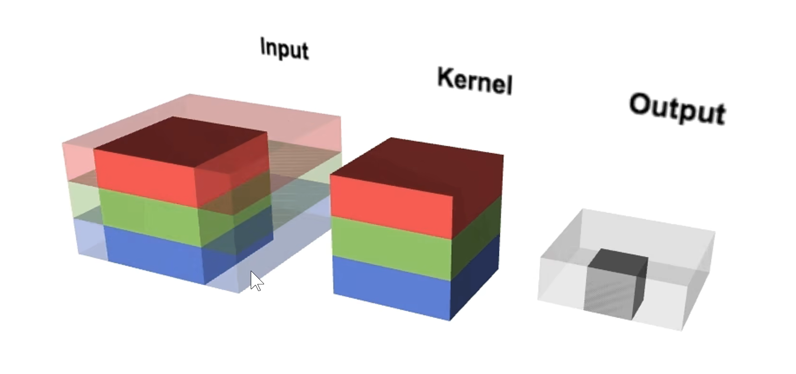

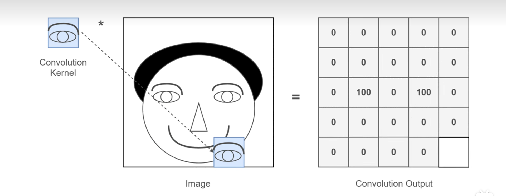

动画演示
<github.com/vdumoulin/conv_arithmetic>
<ezyang.github.io/convolution-visualizer/index.html>

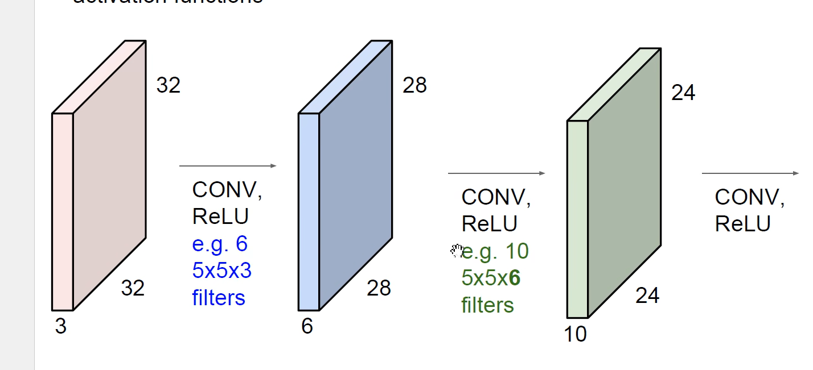

### 池化
feature map 过多

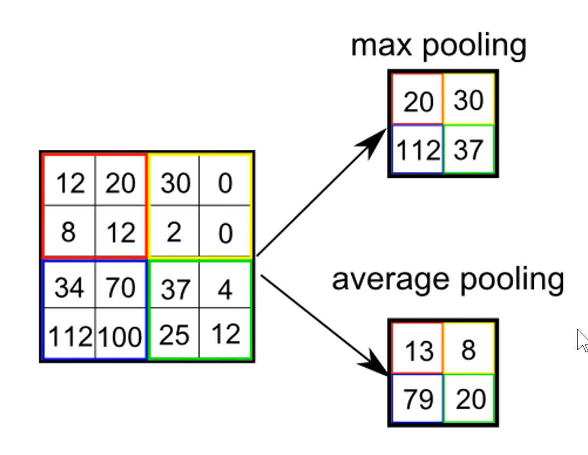

池化的作用：
- 可在一定范围内忽视图像的平移,平移不变性
- 减少参数量（大的变小）
- 防止过拟合
  
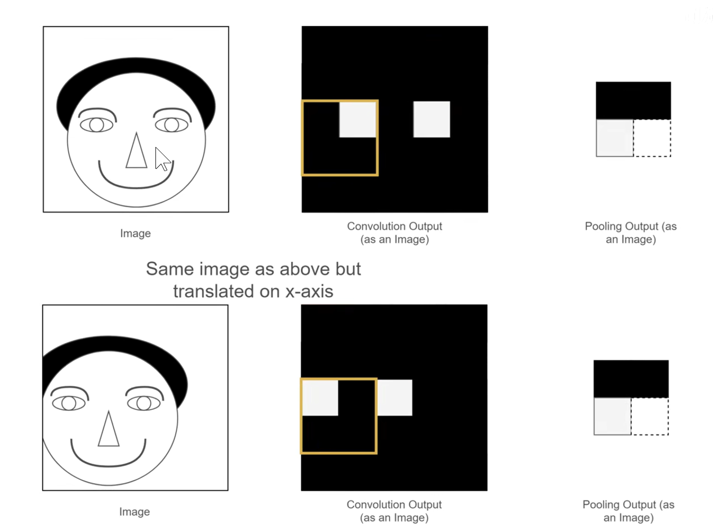

LeNet-5

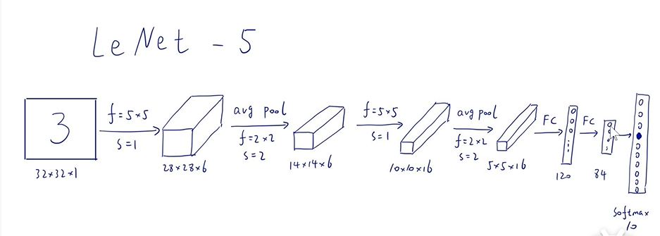

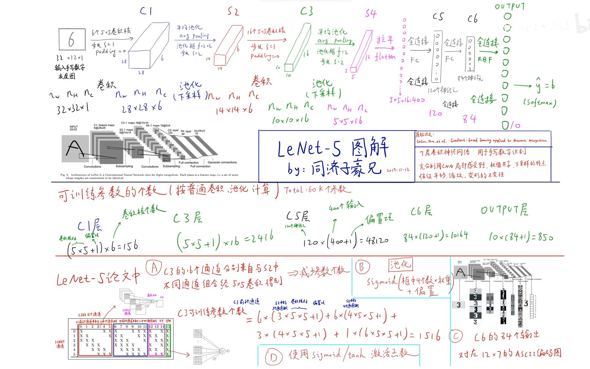

### 全连接

卷积神经网络保持平移、缩放、变形不变性的原因
- 局部感受野
- 权值共享
- 下采样、池化

feature map的维度计算：

$(N-F)/stride + 1$

如果要维度不变,在步长为1的情况下，padding要为：

$P = (F-1)/2$

降维

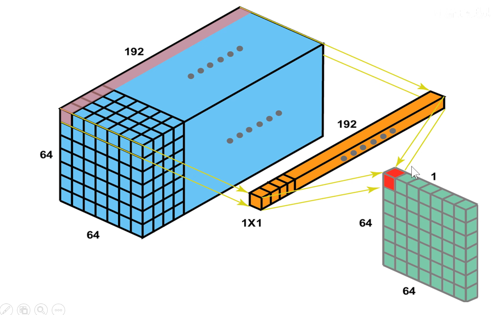

为什么要用1*1?

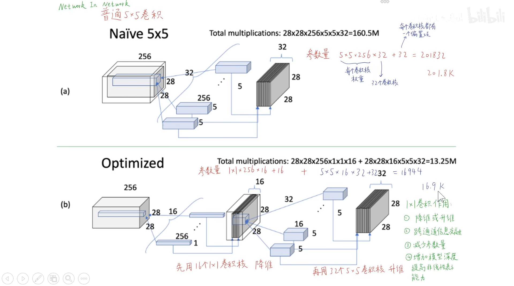