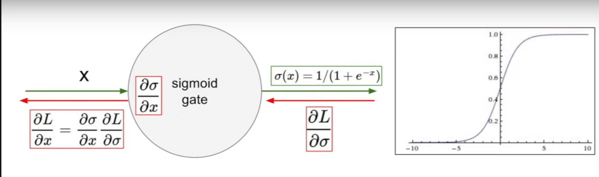
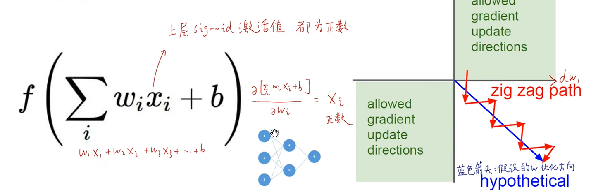
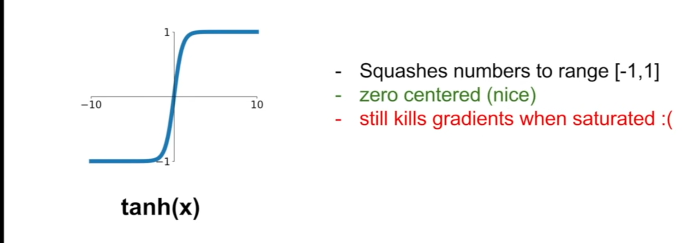
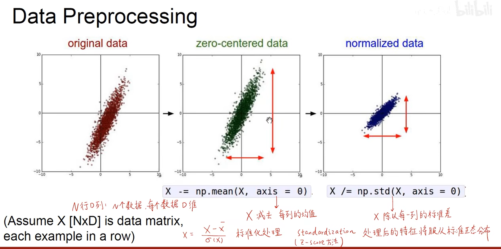
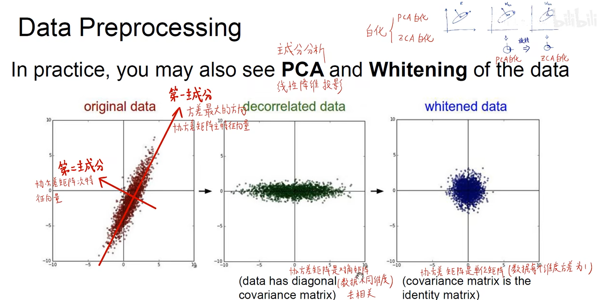
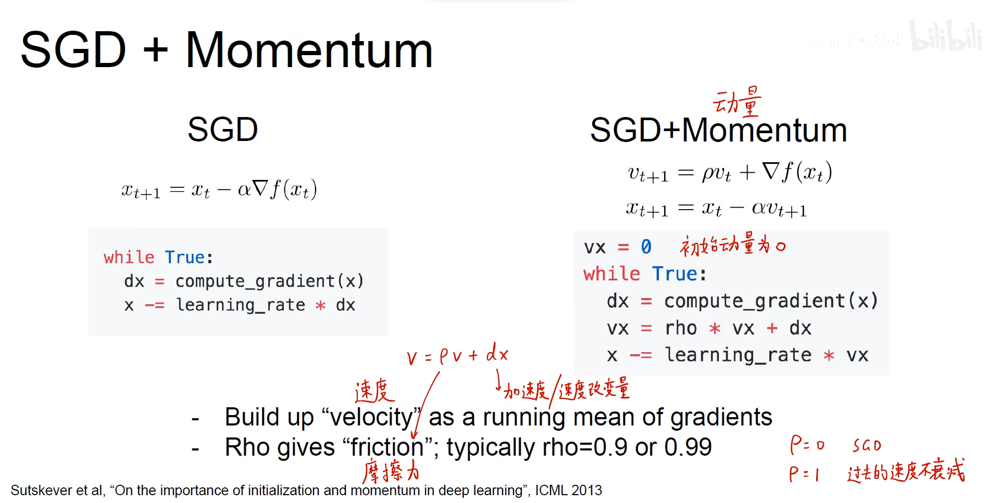
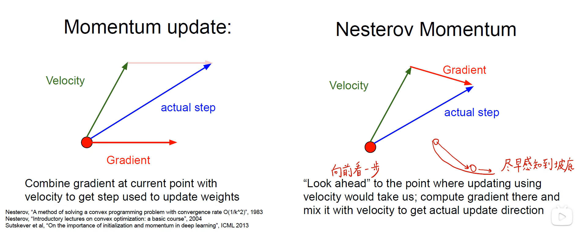
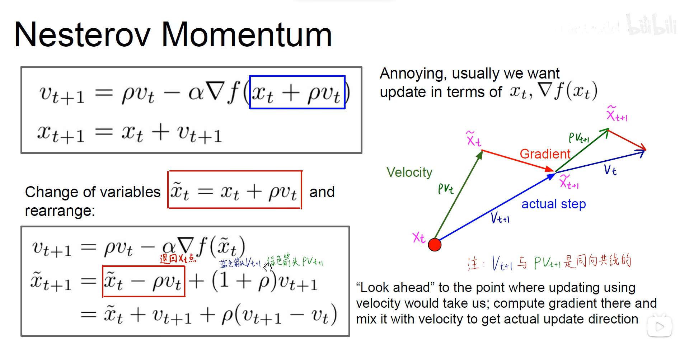

### 训练神经网络

## sigmoid缺点

- 梯度消失

- 输出永远都为正值，导致所有权重进行更新时要么全部增大要么全部减小，效率过低
 

- 指数运算消耗资源

## tanh

## ReLu

$f(x) = max(0, x)$

- 不会饱和
- 容易计算
- 收敛的快

## Leaky ReLu

$f(x) = max(0.01x, x)$

$f(x) = max(αx, x)$ 通过反向传播确定α

## Elu

## Maxout 

### 权重初始化

xavier初始化

msra初始化

### 优化器
SGD（随机梯度下降缺点） 来回震荡，不能通过减小学习率来解决问题；在高维空间会陷入局部最优解

梯度下降 + 动量

nesterov 提前预知

